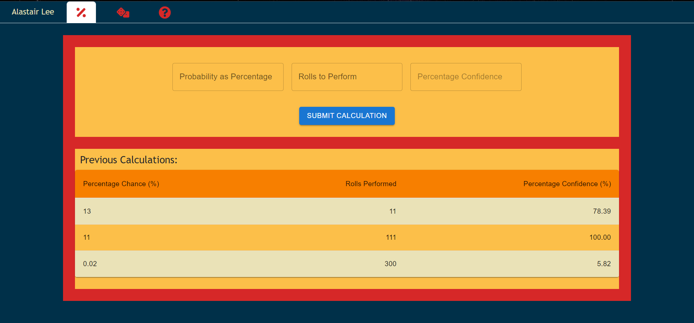

# Pokemon Team Generator

## Description

This application allows a user to create and save pokemon and teams of up to six pokemon. Each pokemon can be saved with their nickname, moveset, ability, nature, EVs, IVs, held item, and tera type. Each of these attributes are checked with or referenced from PokeAPI, ensuring that each pokemon have 'legal' sets based on the current generation.

Users are also able to add and remove pokemon from teams on the team page, as well as edit the pokemon themselves. The edits are also checked using PokeAPI in order to ensure that the pokemon remains legal by the current generation.

Due to lacking a way of deploying an application with a database at present, this app is undeployed, though it has been completed and tested.

## Table of Contents

- [Installation](#installation)
- [Usage](#usage)
- [Credits](#credits)
- [License](#license)
- [Tests](#tests)

## Installation

N/A

## Usage

The page is fully functional. All links and images have been tested and alt text has been provided where required. Below is an image of the screen you should arrive at on loading:

## Contributors

Here is a list of contributors to this application:

N/A

## License

The MIT License: https://opensource.org/licenses/MIT

## Tests

N/A

## Questions

Here are two links to reach out to me:

Github: https://github.com/Honsumal

Email: 14leealastair@gmail.com